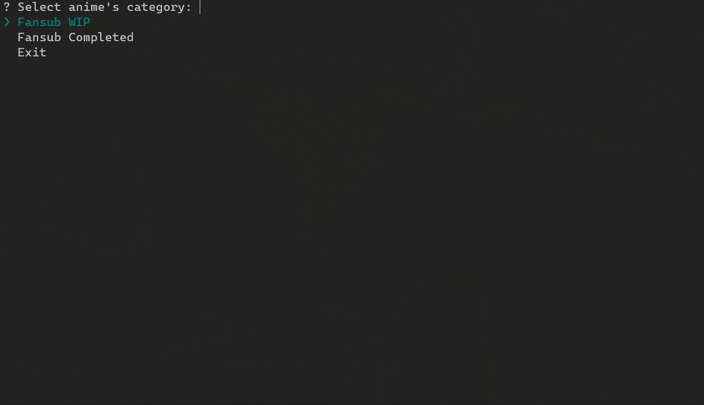

# NIF Dumper

A simple Python CLI tool to search and download NIF (Naruto Italian Forum) releases.

_This utility aims to make easier the download of a whole series due to missing pack downloads_

If you like NIF releases, support the team!

__This project is in no way affiliated with, supported or offered by NIF Team__

## Usage

0) Make sure to have Python 3.7+ and aria2 installed on your system;
   1) Create a folder anywhere on your pc and clone the repository there:

      `git clone https://github.com/LightDestory/NIF-Dumper`

   2) Install the requirements using pip:

      `pip install -r requirements.txt`

   3) Execute the dumber and follow the wizard to start downloading:

      `python ./dumper.py`

## Support

    

## :warning: License

This collection is under GNU GPL-3.0 License.